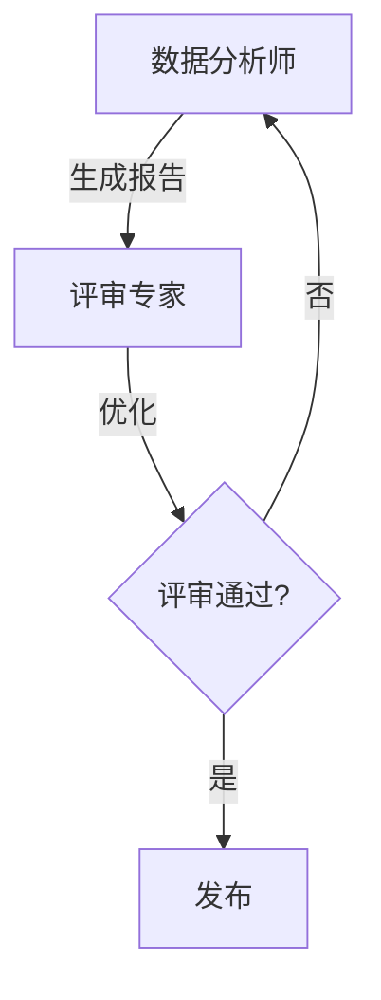

# 多智能体协作架构

在复杂任务场景下，单个 Agent 往往力不从心。多智能体系统通过合理分工与协作，能够处理更复杂的任务。本文深入探讨多 Agent 架构的设计模式与实现。

## 一、协作模式分类

### 1.1 生成式协作

**特点**：Agent 通过 LLM 协作，无需显式消息传递

```python
# Agent A 生成规划
plan = agent_a.plan(task)

# Agent B 执行规划
result = agent_b.execute(plan)

# Agent C 优化结果
optimized = agent_c.refine(result)
```

**适用场景**：创意生成、内容创作

### 1.2 交互式协作

**特点**：Agent 之间显式交换消息和上下文

```python
# 设计模式：Speaker-Listener
speaker = RoleAgent("分析专家")
listener = RoleAgent("决策专家")

while not finished:
    thought = speaker.think(task)
    listener.observe(thought)
    if listener.decide_to_stop():
        break
    listener.respond()
    speaker.receive(listener.message)
```

### 1.3 工作流协作

**特点**：预定义工作流，Agent 按固定顺序执行



## 二、经典架构模式

### 2.1 ReAct 模式（Reason + Act）

核心思想：思考 + 行动 + 观察

```python
def react_loop(agent, task, max_steps=10):
    for step in range(max_steps):
        # 1. 规划下一步
        thought = agent.think(f"任务: {task}\n当前状态: {observation}")
        action = agent.plan_action(thought)

        # 2. 执行行动
        result = agent.execute(action)

        # 3. 观察结果
        observation = agent.observe(result)

        if action.type == "finish":
            return result
```

### 2.2 任务分解模式

将复杂任务分解为子任务链：

```python
def task decomposition_agent(task, context):
    # 1. LLM 分解任务
    subtasks = llm.breakdown(task, context)

    # 2. 创建 Agent 队列
    queue = [Agent(subtask) for subtask in subtasks]

    # 3. 顺序执行
    results = []
    for agent in queue:
        result = agent.run()
        results.append(result)

    # 4. 综合结果
    return llm.synthesize(results)
```

### 2.3 咨询模式

一个主 Agent 指挥多个专用 Agent：

```python
class OrchestratorAgent:
    def __init__(self):
        self.specialists = {
            "coder": CodeAgent(),
            "tester": TestAgent(),
            "docs": DocumentationAgent()
        }

    def solve(self, problem):
        # 分配给专用 Agent
        coder_result = self.specialists["coder"].implement(problem)
        test_result = self.specialists["tester"].verify(coder_result)
        docs_result = self.specialists["docs"].document(coder_result)

        return {
            "code": coder_result,
            "tests": test_result,
            "docs": docs_result
        }
```

## 三、通信机制设计

### 3.1 消息格式标准化

```python
class AgentMessage:
    sender: str
    receiver: str
    timestamp: datetime
    type: str  # "thought", "action", "observation", "request", "response"
    content: Any
    metadata: Dict[str, Any]
```

### 3.2 上下文传递策略

```python
def collaborate(agents: List[Agent], task: str):
    # 1. 共享上下文（适合紧密协作）
    shared_context = ContextStore()

    # 2. 流式上下文（适合流水线协作）
    context_flow = ContextFlow(
        forward=True,    # 逐级传递
        backward=True,   # 支持回溯
        truncate=True    # 自动截断长上下文
    )

    # 3. 事件驱动（适合松耦合系统）
    event_bus = EventBus()
```

## 四、挑战与解决方案

### 4.1 一致性问题

**问题**：多个 Agent 可能给出相互矛盾的结果

**解决方案**：
- 主 Agent 负责协调和裁决
- 投票机制（多数决策）
- 评审流程（人工或 LLM 评审）

### 4.2 通信开销

**问题**：频繁通信消耗大量 Token

**解决方案**：
- 批量处理消息
- 选择性传播（只传递必要信息）
- 上下文压缩

### 4.3 信任与协作

**问题**：Agent 之间可能不信任彼此

**解决方案**：
- 定义明确的角色和契约
- 建立信任评分机制
- 可追溯的历史记录

## 五、实现框架推荐

### 5.1 LangGraph

适合状态机模式的多 Agent 系统

```python
from langgraph.graph import StateGraph

def create_collab_graph():
    workflow = StateGraph(State)

    # 添加节点
    workflow.add_node("analyzer", analyzer_node)
    workflow.add_node("planner", planner_node)
    workflow.add_node("executor", executor_node)
    workflow.add_node("reviewer", reviewer_node)

    # 添加边
    workflow.add_edge("analyzer", "planner")
    workflow.add_edge("planner", "executor")
    workflow.add_edge("executor", "reviewer")
    workflow.add_edge("reviewer", "analyzer")

    return workflow.compile()
```

### 5.2 CrewAI

适合生成式协作和角色扮演

```python
from crewai import Agent, Task, Crew

# 定义角色
researcher = Agent(
    role="Researcher",
    goal="Gather accurate information",
    backstory="You are an expert researcher...",
    tools=[search_tool, browser_tool]
)

writer = Agent(
    role="Writer",
    goal="Create compelling content",
    backstory="You are a skilled writer..."
)

# 定义任务
task1 = Task(
    description="Research the topic",
    agent=researcher,
    expected_output="Research report"
)

task2 = Task(
    description="Write an article",
    agent=writer,
    context=[task1],
    expected_output="Article text"
)

# 执行
crew = Crew(agents=[researcher, writer], tasks=[task1, task2])
result = crew.kickoff()
```

## 六、最佳实践总结

| 模式 | 适用场景 | 优势 | 挑战 |
|------|----------|------|------|
| ReAct | 探索式任务 | 灵活、自适应 | 步骤多、延迟高 |
| 任务分解 | 长任务链 | 模块化、可测试 | 协调复杂 |
| 咨询模式 | 问题求解 | 职责清晰 | 通信开销 |
| 工作流 | 流水线任务 | 可预测、可控 | 不够灵活 |

## 七、参考资源

- [Multi-Agent Emergence: Scaling Laws](https://arxiv.org/abs/2401.05667)
- [CrewAI 官方文档](https://www.crewai.com/introduction)
- [AutoGen: Microsoft 多 Agent 框架](https://microsoft.github.io/autogen/)

---

**相关文章**：
- [AI Agent 系统概览](/posts/ai-agent-概览.html)
- [Agent 工程化最佳实践](/posts/agent-工程化.html)
